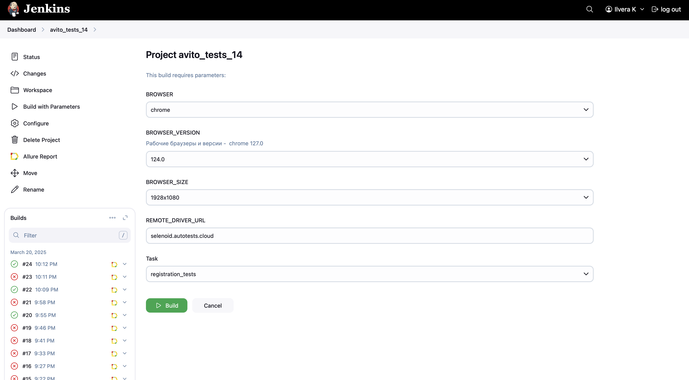
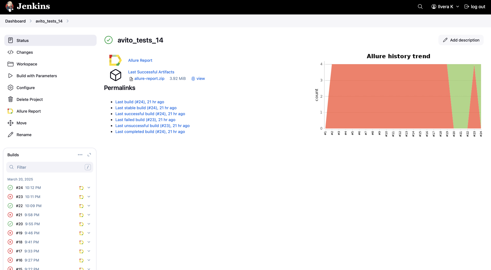
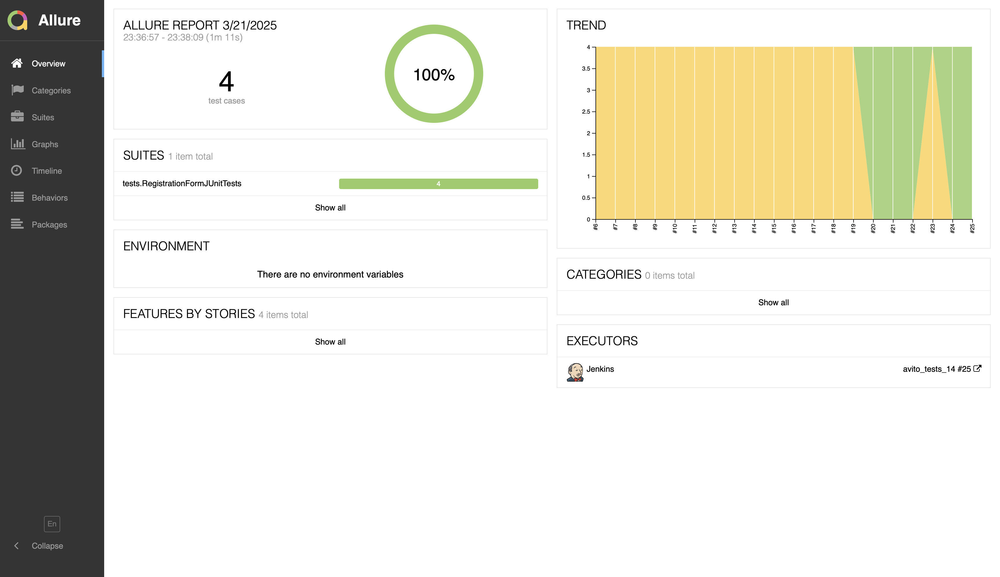
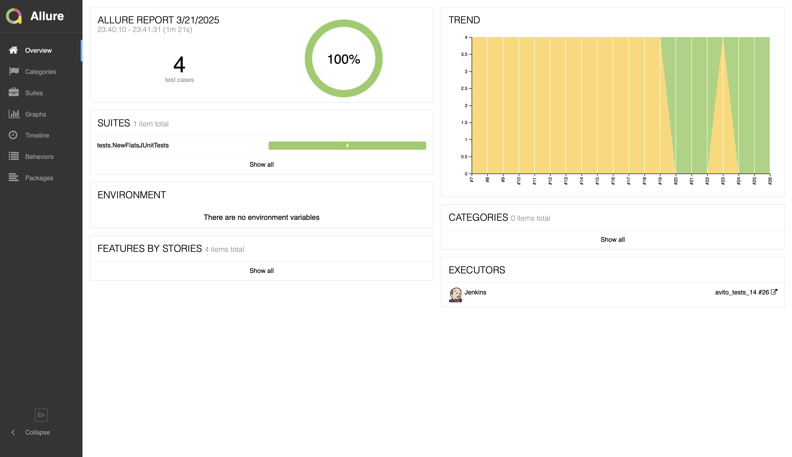
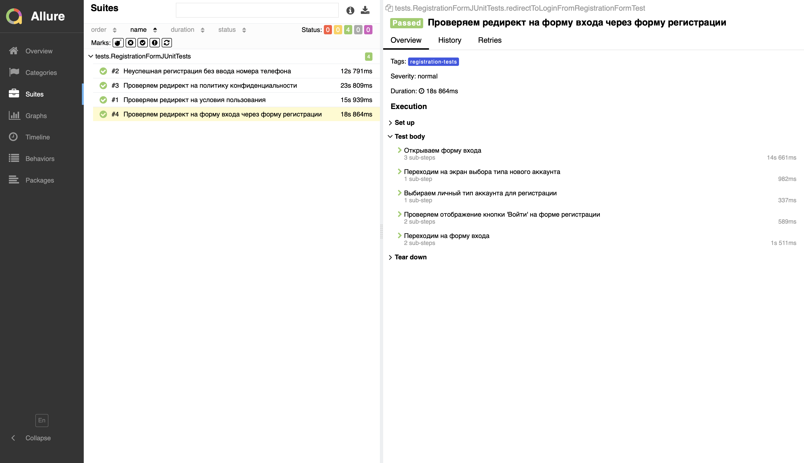
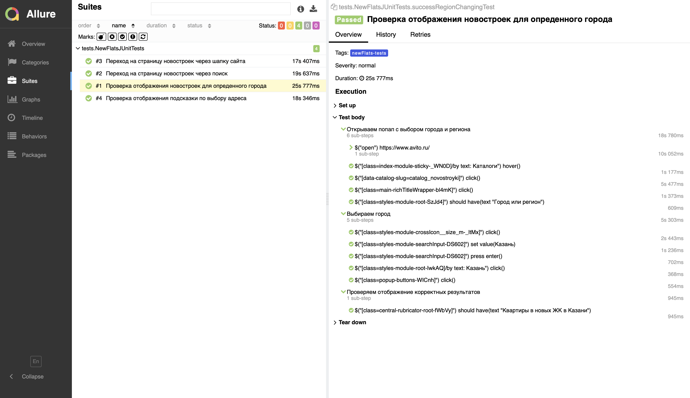
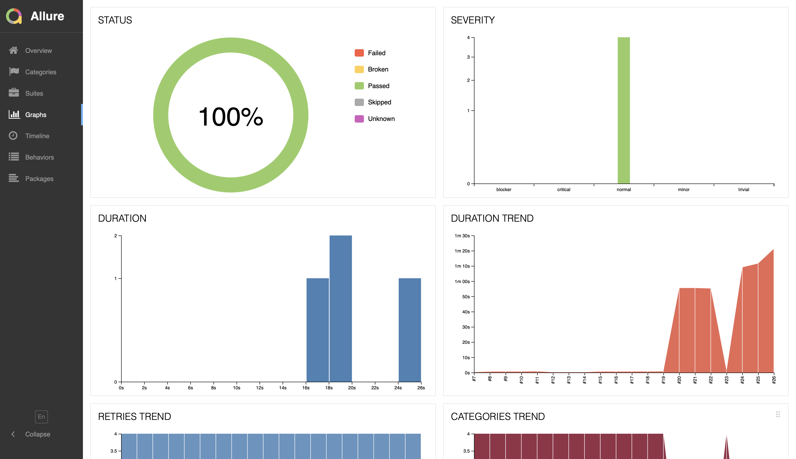
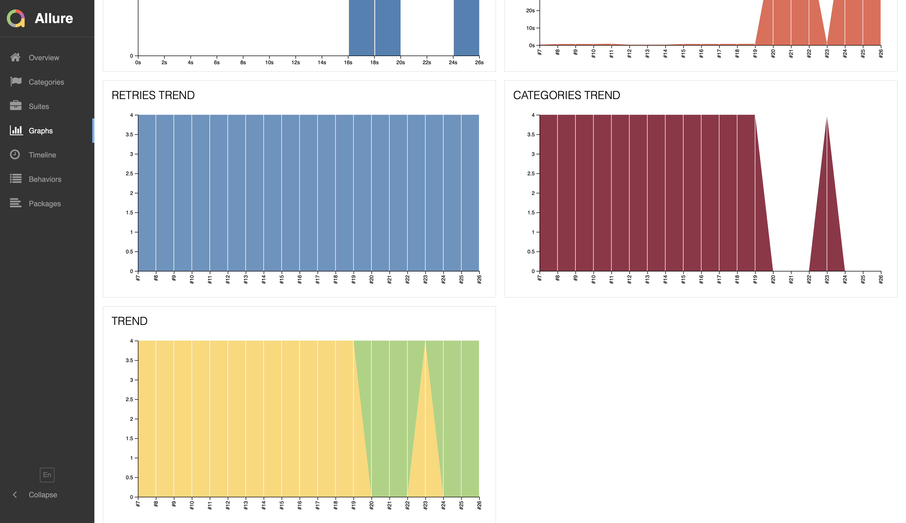
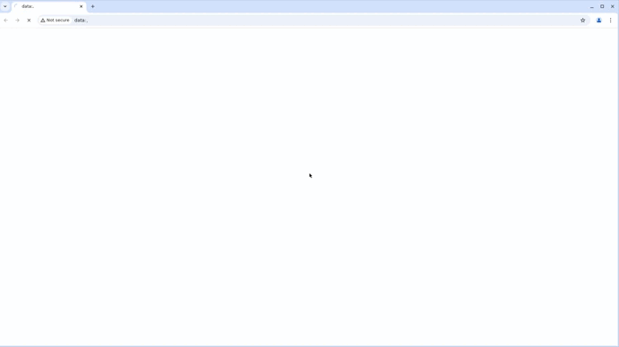
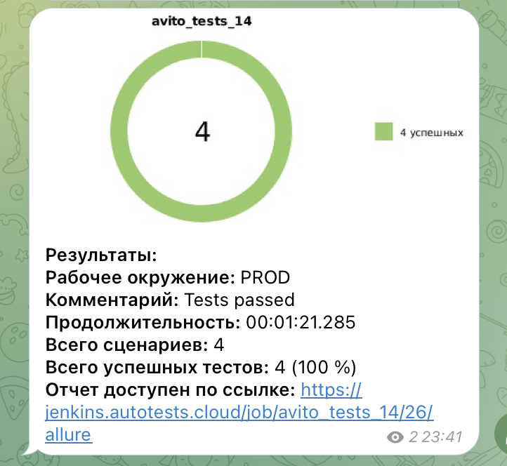

# Проект по автоматизации тестирования для компании [Avito](https://www.avito.ru)

## Содержание
* <a href="#annotation">Описание</a>
* <a href="#tools">Технологии и инструменты</a>
* <a href="#cases">Реализованные проверки</a>
* <a href="#localrun">Локальный запуск тестов</a>
* <a href="#remoterun">Удаленный запуск тестов</a>
* <a href="#jenkins">Запуск тестов в Jenkins</a>
* <a href="#allure">Отчеты в Allure</a>
* <a href="#video">Пример прогона теста в Selenoid</a>
* <a href="#telegram">Уведомления в Telegram с использованием бота</a>


<a id="annotation"></a>
## Описание
Проект состоит из UI-тестов, цель которых повысить качество продукта и сократить время на тестирование.  
<a id="tools"></a>
## Технологии и инструменты
<div align="center">
<a href="https://www.jetbrains.com/idea/"></a>
<a href="https://github.com/"></a>  
<a href="https://www.java.com/"></a>
<a href="https://gradle.org/"></a>  
<a href="https://junit.org/junit5/"></a>
<a href="https://selenide.org/"></a>
<a href="https://aerokube.com/selenoid/"></a>
<a href="https://www.jenkins.io/"></a>
<a href="https://github.com/allure-framework/"></a>
<a href="https://telegram.org/"></a>
</div>

<a id="cases"></a>
## Реализованные проверки
*  Неуспешная регистрация без ввода номера телефона
* Проверяем редирект на форму входа через форму регистрации
* Проверяем редирект на условия пользования
* Проверяем редирект на политику конфиденциальности
* Переход на страницу новостроек через  шапку сайта
* Переход на страницу новостроек через поиск
* Проверка отображения новостроек для опреденного города
* Проверка отображения подсказки по выбору адреса

<a id="localrun"></a>
## Локальный запуск тестов
Для локального запуска тестов из IDE или из терминала необходимо выполнить следующую команду:
```
gradle clean registration_tests
```
```
gradle clean newFlats_tests
```
<a id="remoterun"></a>
## Удаленный запуск тестов   
Для удаленного запуска тестов нужно выполнить следующие команды:

```
clean
${TASK}
-Ddriver=${REMOTE_DRIVER_URL}
-Dbrowser=${BROWSER}
-Dversion=${BROWSER_VERSION}
-Dsize=${BROWSER_SIZE}
```
> `${TASK}` - вид тестов для запуска
>
> `${REMOTE_DRIVER_URL}` - адрес удаленного сервера, на котором будут запускаться тесты
>
> `${BROWSER}` - наименование браузера (_по умолчанию - <code>chrome</code>_)
>
> `${BROWSER_VERSION}` - номер версии браузера (_по умолчанию - <code>124.0</code>_)
>
> `${BROWSER_SIZE}` - размер окна браузера (_по умолчанию - <code>1928x1080</code>_)
>
<a id="jenkins"></a>
## Запуск тестов в <a target="_blank" href="https://jenkins.autotests.cloud/job/avito_tests_14/"> Jenkins </a>
* Перед запуском тестов необходимо выбрать параметры
<p align="center">

</p>

* После прохождения тестов на главной проекта отображаются результаты в виде графика, ссылок на логи и отчеты:
<p align="center">

</p>

<a id="allure"></a>
## Отчеты Allure report 
* Отчет для тестов с тегом `registration_tests` - <a target="_blank" href="https://jenkins.autotests.cloud/job/avito_tests_14/25/allure/"> Allure report </a>
* Отчет для тестов с тегом `newFlats_tests` - <a target="_blank" href="https://jenkins.autotests.cloud/job/avito_tests_14/26/allure/"> Allure report </a>
### Основное окно
<p align="center">

</p>
<p align="center">

</p>

### Тесты
<p align="center">

</p>
<p align="center">

</p>

### Графики
<p align="center">

</p>
<p align="center">

</p>

<a id="video"></a>
## Пример прогона теста в Selenoid
* Для каждого теста в Allure создается видео с прогоном:
<p align="center">

</p>

<a id="telegram"></a>
## Уведомления в Telegram с использованием бота
* После каждого прогона тестов  бот отправляет уведомление в Telegram со ссылкой на Allure отчет:
<p align="center">

</p>

